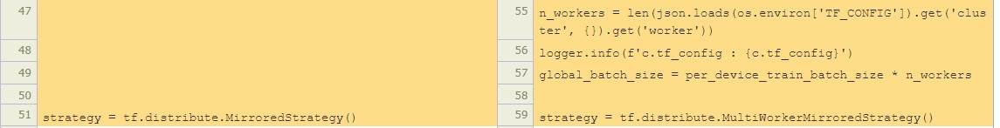

## install datasets and transformers from huggingface

```bash
pip install transformers==4.21.2
pip install tokenizers==0.12.1
pip install datasets==2.4.0
```

## local

* data preparing
```bash
python predata.py
```

* model training
```bash
python train.py --data="./data_mlm"
```

## netmind platform
* Run locally with netmind-mixin
    1. Follow the [Installation](https://github.com/protagolabs/Netmind-examples/tree/main) section in main page.

    2. create the config.py file as add your ip information (you can access those information by "ifconfig") to each gpu (2 gpus):
        ```bash
        tf_config = {
            'cluster': {
                'worker' : ['192.168.1.16:30000', '192.168.1.16:30001'],
            },
            'task': {'type': 'worker'}
        }
        ```
        **"192.168.1.16" is the ip on my single machine, if you have different gpus on different machines, please use the correct ones.**

    3. modify your code as follows (you can compare the train_netmind.py in corresponding [local tasks](https://github.com/protagolabs/Netmind-examples/tree/main/tensorflow/local) and current directory for more details):

        * add netmind class
            

        * add environment
            

        * change the distributed strategy
            

        * add  the netmind callbacks 
            
        


        


